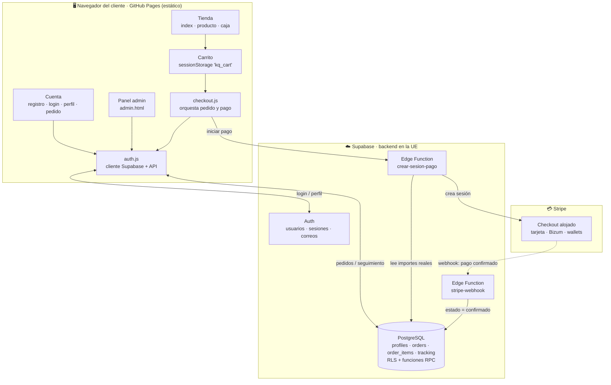
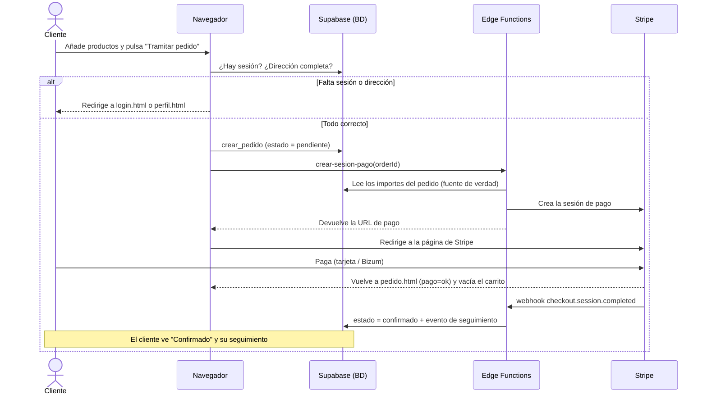
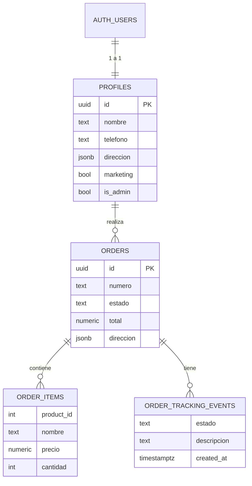
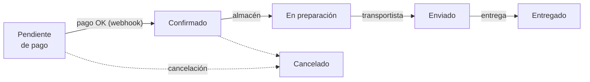
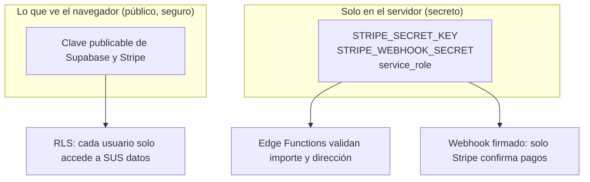

# Arquitectura de El Kiosquillo

Mapa visual de la solución de e-commerce. Los diagramas se renderizan
automáticamente al ver este archivo en GitHub.

---

## 1. Componentes y cómo se conectan

---

## 2. Flujo de compra y pago (paso a paso)

---

## 3. Modelo de datos (tablas y relaciones)

---

## 4. Estados de un pedido

> El cliente solo avanza hasta **Confirmado** (al pagar). De ahí en adelante,
> los estados los cambia el administrador desde `admin.html`, y cada cambio
> genera un evento que el cliente ve en el seguimiento de su pedido.

---

## 5. Seguridad en una mirada

