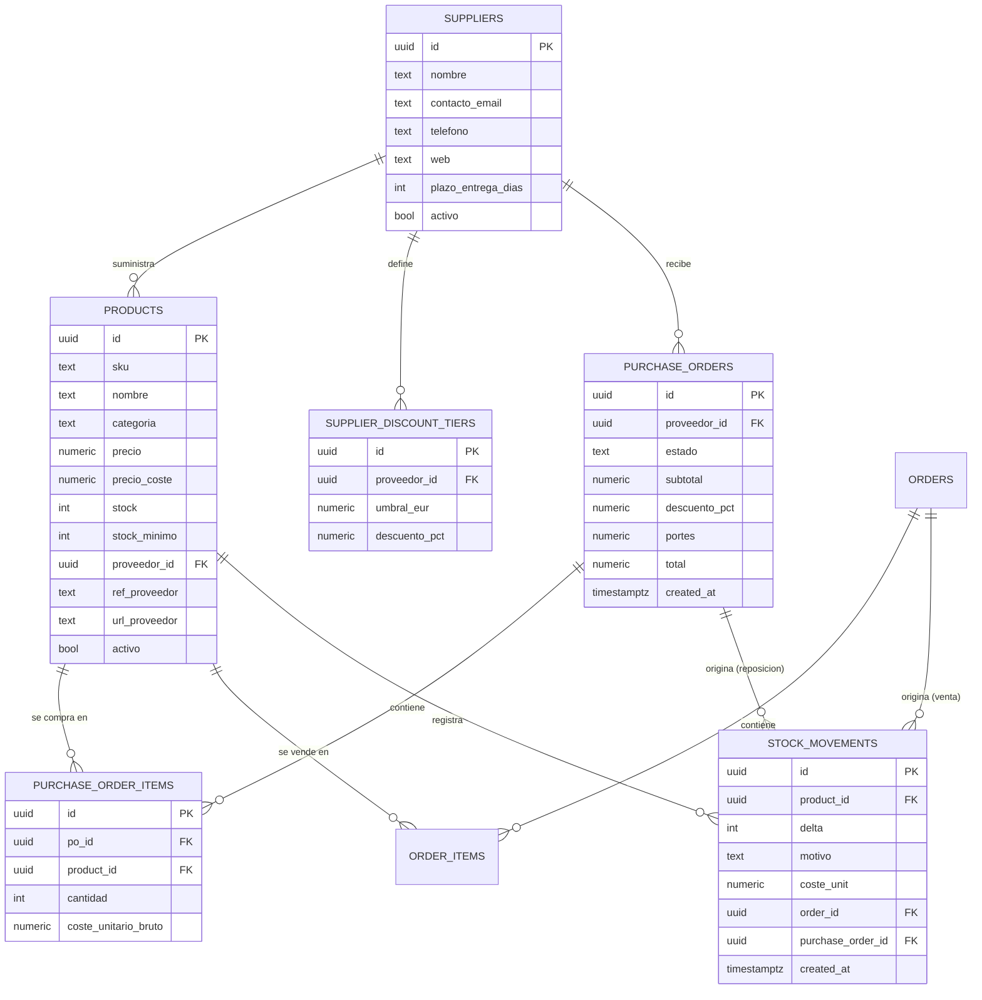
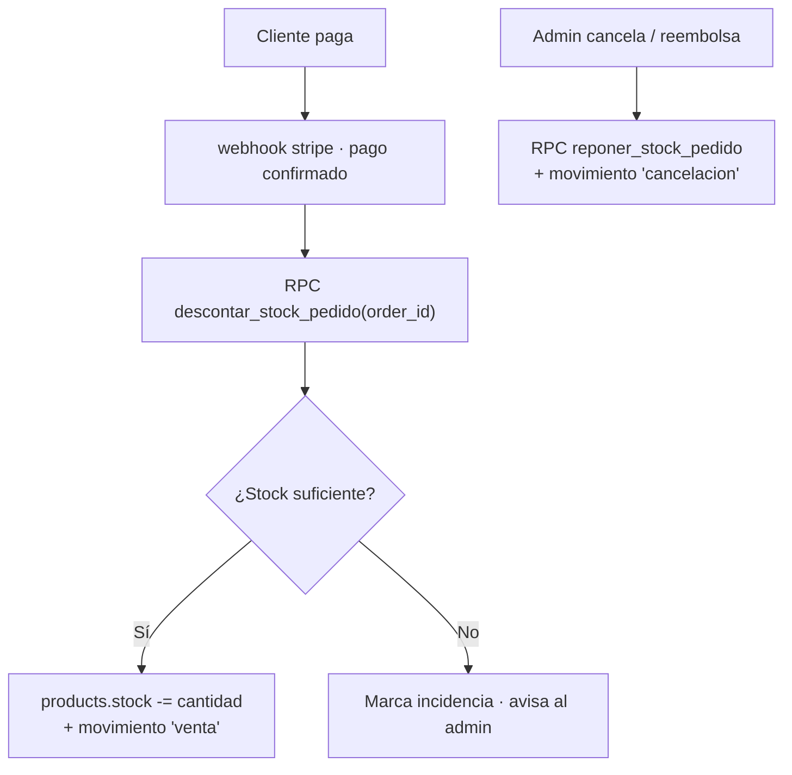
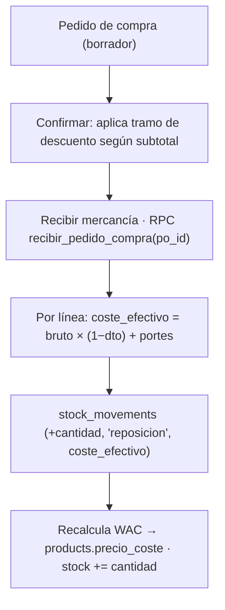
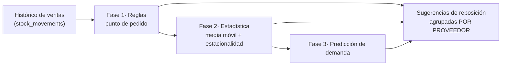

# Diseño del sistema de inventario · El Kiosquillo

Diseño de la gestión de inventario, proveedores, compras (con descuentos),
coste medio de adquisición, gestión de pedidos y, a futuro, pedidos
predictivos. Los diagramas se renderizan al ver este archivo en GitHub.

> Estado: **diseño**. Se implementa por fases (ver el roadmap al final).

---

## 1. Principio rector: la base de datos manda

Hoy el catálogo vive en `productos_data.js` (en el navegador). Para tener
inventario real, el catálogo pasa a una tabla **`products`** en Supabase, que
se convierte en la única fuente de verdad. Esto consigue a la vez:

- **Stock y precios reales y centralizados.**
- **Blindaje de precios:** el cobro usa el precio de la BD, no el del navegador.

La tienda pasa a **leer el catálogo desde Supabase** (stock y precio en vivo).

---

## 2. Modelo de datos



**Pieza clave: `stock_movements`** es el libro mayor de movimientos (venta,
reposición, ajuste, devolución, cancelación), con el coste de cada entrada.
`products.stock` es el saldo actual; el histórico de movimientos alimenta los
informes y lo predictivo.

---

## 3. Alta, edición y precios de productos

Sección **"Productos"** en el panel de administración (`admin.html`):

| Acción | Cómo |
|---|---|
| Dar de alta | Formulario → RPC `crear_producto` |
| Editar / cambiar precio | Edición en línea → RPC `actualizar_producto` |
| Activar/desactivar | Toggle `activo` (oculta de la tienda sin borrar) |
| Entrada de stock manual | RPC `ajustar_stock(product_id, +N, 'ajuste')` |

- **Seguridad:** todo protegido por `is_admin()`. Lectura pública solo de `activo = true`.
- **Precios históricos:** al vender, `order_items` **congela el precio** de ese
  momento → cambiar un precio no altera pedidos pasados ni facturas.

---

## 4. Stock automático con las ventas



- Se descuenta **al confirmarse el pago** (en el webhook actual), de forma atómica.
- Cancelaciones/devoluciones **reponen** stock.
- La tienda marca **"Agotado"** cuando `stock ≤ 0`.
- **Aviso de stock bajo** en el panel cuando `stock ≤ stock_minimo`.
- *Opcional avanzado:* reservar stock al crear el pedido pendiente (para
  productos muy escasos) y liberarlo si no se paga.

---

## 5. Proveedores y trazabilidad

Cada producto tiene un **proveedor principal** (`proveedor_id`) + su referencia
(`ref_proveedor`) y enlace (`url_proveedor`). (Si se compra el mismo producto a
varios proveedores, se añadiría una tabla intermedia `product_suppliers`.)

**Vistas en el panel:**
1. **Listado de productos** con columna y **filtro por proveedor**.
2. **Vista "Proveedores"**: lista con nº de productos, valor de stock y plazo;
   al pulsar, todos los productos de ese proveedor.
3. **Ficha de producto**: proveedor, referencia, coste, margen y enlace para reponer.
4. **Trazabilidad venta → proveedor**: `order_item → product → supplier`.

Vista SQL de conveniencia para listar inventario con su proveedor:

```sql
create view vista_inventario as
select p.id, p.nombre, p.categoria, p.stock, p.stock_minimo,
       p.precio_coste, p.precio,
       round((p.precio - p.precio_coste), 2) as margen_eur,
       s.id as proveedor_id, s.nombre as proveedor, s.plazo_entrega_dias
from products p
left join suppliers s on s.id = p.proveedor_id;
```

---

## 6. Compras al proveedor, descuentos por volumen y coste medio (WAC)

### 6.1 Descuentos por umbral

El descuento se aplica **a nivel de pedido de compra** (depende del total).
Las reglas escalonadas (`supplier_discount_tiers`) permiten p. ej.:
*Fini: ≥200 € → 5 %, ≥500 € → 10 %*. Al confirmar el pedido se aplica el tramo
que corresponda al subtotal.

### 6.2 Reparto del descuento a cada producto

- **Descuento porcentual:** el **mismo %** a cada línea (exacto).
  ```
  coste_unitario_neto = coste_unitario_bruto × (1 − descuento_pct)
  ```
- **Descuento de importe fijo:** se **prorratea** por el valor de cada línea.
- **Portes del proveedor:** se **capitalizan** (se reparten entre líneas por
  valor o peso).
- Todo **neto de IVA** (el IVA soportado es deducible, no es coste).

```
coste_efectivo_unit = coste_bruto_unit × (1 − descuento_pct) + portes_prorrateados_unit
```

### 6.3 Precio medio de adquisición: Coste Medio Ponderado (WAC)

En cada recepción se recalcula el coste medio mezclando lo existente con lo que entra:

```
nuevo_coste_medio =
   (stock_actual × coste_medio_actual) + (cantidad_recibida × coste_efectivo_unit)
   ─────────────────────────────────────────────────────────────────────────────
                       stock_actual + cantidad_recibida
```

**Ejemplo (con descuento por umbral):**
- 100 uds en almacén a 0,40 € → valor 40,00 €
- Compra de 200 uds a 0,42 € (bruto); el pedido supera el umbral → 10 % dto:
  - coste efectivo = 0,42 × (1 − 0,10) = **0,378 €/ud**
- Nuevo coste medio = (100×0,40 + 200×0,378) / 300 = 115,60 / 300 = **0,3853 €/ud**
- Resultado: `stock = 300`, `precio_coste = 0,3853 €`.

### 6.4 Flujo de recepción



### 6.5 Detalles de corrección

| Punto | Recomendación |
|---|---|
| Método de valoración | **WAC** (un `precio_coste` por producto). Alternativa: FIFO por lotes (control de caducidad). |
| IVA | El coste va **sin IVA**. |
| Portes | Capitalizar (prorratear entre líneas). |
| Descuento % | Mismo % a todas las líneas. |
| Descuento fijo | Prorratear por valor de línea. |
| Devolución a proveedor | Movimiento negativo al coste de entrada. |
| Margen | `precio − precio_coste(WAC)`; se recalcula al cambiar el coste medio. |

---

## 7. Gestión de pedidos (ventas)

Sobre lo ya existente (estados + seguimiento en `admin.html`) se añade:
- Vínculo **pedido → productos** para informes (ventas, márgenes).
- **Cancelar/Reembolsar** → repone stock (+ reembolso en Stripe).
- **Métricas:** ventas por día, más vendidos, margen.

---

## 8. Pedidos predictivos (futuro)



- **Punto de pedido** = `demanda_media_diaria × plazo_entrega_proveedor + stock_seguridad`.
  El plazo lo aporta cada proveedor → umbral propio por proveedor.
- **Estacionalidad** (Halloween, Navidad, Carnaval, vuelta al cole).
- Salida: **borradores de pedido de compra por proveedor** que el admin revisa y confirma.

---

## 9. Seguridad (RLS)

| Tabla | Lectura | Escritura |
|---|---|---|
| `products` | Pública (solo `activo`) | Solo admin |
| `suppliers`, `purchase_orders`, `stock_movements` | Solo admin | Solo admin |
| `order_items` (ventas) | El dueño del pedido y admin | Vía RPC en el pago |

Las operaciones sensibles (recepción de compra, descuento de stock) se hacen
mediante **funciones RPC `security definer`** y validación en servidor.

---

## 10. Roadmap de implementación

| Fase | Contenido |
|---|---|
| **1** | `products` + `suppliers` · migrar catálogo (con proveedor) · tienda y cobro leen de la BD |
| **2** | Admin de productos: alta/edición, precios, vista "Proveedores", filtro por proveedor, ajustes de stock |
| **3** | Descuento automático de stock al pagar · reposición en cancelación · `stock_movements` · avisos de stock bajo |
| **4** | Informes de ventas y márgenes |
| **5** | Compras a proveedor: pedidos de compra, **descuentos por umbral**, **coste medio ponderado (WAC)**, recepción de mercancía |
| **6** | Predictivo: sugerencias de reposición (reglas → estadística) agrupadas por proveedor |

La **Fase 1** es la prioritaria y además resuelve el blindaje de precios para
cobrar con seguridad.
